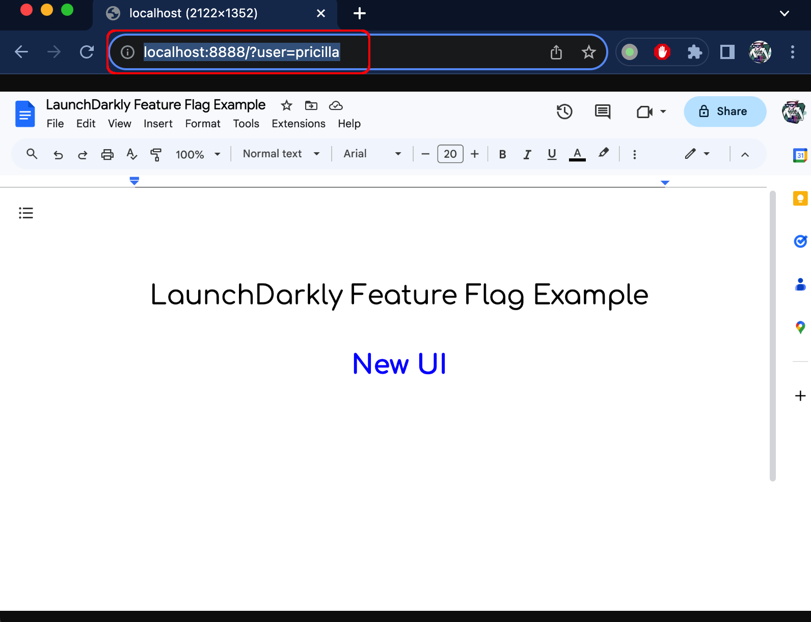

# feature-flag-example
This project provides an example of the use of a [LaunchDarkly](https://launchdarkly.com/) feature flag.

The example runs as a Web Service that you can connect to in your browser, using a query string to set a user name like this:

		http://<host>:8888?user=mark

Depending on the setting of a feature flag and a targeting rule, the response will either be a web page showing an ugly old version of a UI, or a new modern version of a UI.

## Prerequisites

- A Python 3.8+ environment

- [Flask](https://pypi.org/project/Flask/) - A Python web application framework (tested with v3.0.0)
  
  You can install Flask using the command: <code>$ pip install flask~=3.0</code>

- LaunchDarkly SDK for Python (tested with v9.0.1)

  You can install the SDK using the command: <code>$ pip install launchdarkly-server-sdk</code>

## Feature Flag Setup

- Create a LaunchDarkly kill switch feature flag named <code>use_new_ui</code> with a key of the same name and of type <code>boolean</code>. Set the default rule for unmatched contexts to <code>Disabled</code>

## Install and configure the example

- Open a terminal session and clone this project to your local machine or to the machine where you want to run it using the command:

	<code>$ git clone https://github.com/onefoursix/feature-flag-example</code>

  That will give you the directory <code>feature-flag-example</code>
  
- Export your LaunchDarkly SDK API key in an environment variable named <code>LAUNCH_DARKLY_SDK_API_KEY</code>. 

  For example:

  <code>$ export LAUNCH_DARKLY_SDK_API_KEY="sdk-1a1a1a1a1a-1a1a-1a1a-1a1a-1a1a1a1a1a1a"</code>

- By default, the example service listens on port 8888; you can change that if you like by editing the <code>port</code> variable's value [here](https://github.com/onefoursix/feature-flag-example/blob/8bbe6d7fabe0d4148bd22d1bd589ec0716b8e3b6/python/main.py#L13)</code>.  Make sure your firewall rules allow inbound connections on the specified port.

## Run the example 
- Change to the project's <code>python</code> directory:

	<code>$ cd feature-flag-example/python</code>

- Run the example using the command:

	<code>$ python3 main.py</code>
	
  You should see command line output like this, including confirmation that the LaunchDarkly SDK was successfully initialized: 
  
  
  
  Keep this terminal session running for the duration of the test.

- Point your browser to the service URL, which in my case, with the app running on my local machine, is  <code>http://localhost:8888</code>.  You should see the old UI displayed (as a mockup) like this:

  

## Switch to the new UI

- Change the default rule for unmatched contexts for the <code>use_new_ui</code> feature flag to <code>Enabled</code>, refresh the browser page, and you should see the new UI:

  

Revert the default rule for unmatched contexts for the <code>use_new_ui</code> feature flag back <code>Disabled</code> and confirm the old UI is displayed again.

## Add a target for an individual user

- Add a target that enables the <code>use_new_ui</code> feature flag for an individual user. In my case I will enable the flag for the user <code>pricilla</code>:

  

- Test that a non-targeted user still sees the old UI. For example, using a URL for the user <code>elvis</code> like this <code>http://localhost:8888/?user=elvis</code>, we see that elvis still gets the old UI:

  
  
- Confirm that the user <code>pricilla</code> gets the new UI with the URL <code>http://localhost:8888/?user=pricilla</code>
  
    
  
- This confirms that we have successfully configured a targeting rule.
   
